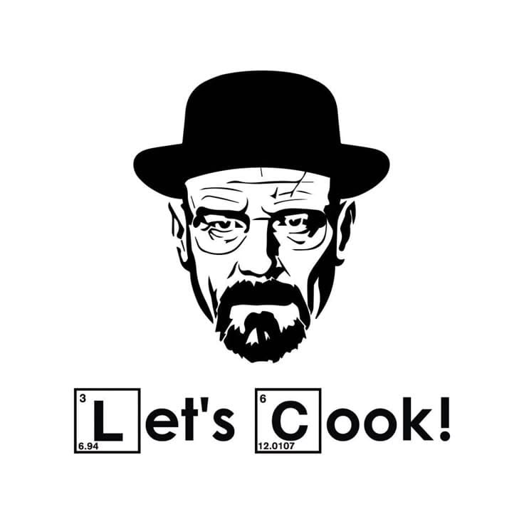

<h1 align="center">🧩 My Puzzle 🧩</h1>

<p align="center">
  Un jeu de puzzle interactif et fou développé en JavaScript
</p>

<p align="center">
  <a href="https://qallouj.github.io/My_Puzzle/">
    
  </a>
  <a href="./README_EN.md">
    
  </a>
  <a href="./README.md">
    
  </a>
</p>

---

# Jouer Maintenant

<p align="center">
  <a href="https://qallouj.github.io/My_Puzzle/">
    
  </a>
</p>

<p align="center">
  https://qallouj.github.io/My_Puzzle/
</p>

<p align="center">
  <a href="https://qallouj.github.io/My_Puzzle/">
  
  </a>
</p>

<h3 align="center">
  Si tu arrives à résoudre un puzzle avec 1000 pièces
  <br>
  Tu es officiellement LE DANGER, pas Heisenberg
</h3>

---

<p align="center">
  
</p>

<p align="center">
  <i>"I am not in danger, Skyler. I am the danger."</i>
</p>

---

# A Propos du Jeu

**My Puzzle** est un jeu de puzzle interactif dingue développé en JavaScript où tu dois reconstruire une image en déplaçant et tournant les pièces correctement.

---

# Comment Jouer

## Etape 1: Charger une image

- Clique sur **"default image"** pour utiliser l'image par défaut
- Ou clique sur **"load image"** pour choisir ta propre image

## Etape 2: Afficher l'image

- Clique sur **"show image"** pour voir l'image complète avant de jouer

## Etape 3: Configurer la difficulte

Personnalise ton puzzle avec ces options:

### Rotations (Rotation Steps)
- **2 steps/turn** - Facile, tu peux tourner les pièces facilement
- **3, 4, 6 steps/turn** - Moyen, c'est plus compliqué
- **8, 12 steps/turn** - Difficile, tu vas te perdre les rotations

### Nombre de Pieces
- **12 pieces** - COMMENCE ICI pour la première fois
- **25 pieces** - Facile
- **50, 100 pieces** - Moyen
- **200, 500 pieces** - Difficile
- **1000 pieces** - T'es le danger maintenant, pas Heisenberg

### Style des Bords
- **classic** - Les bords normaux
- **triangle, polygonal, other** - Bords plus complexes

### Entre les Pieces
- **thin line, flat, beveled** - Apparence visuelle des bords

## Etape 4: Demarrer le Jeu

- Clique sur **"start game"** pour commencer
- Un chronometre apparait en haut
- Deplace et tourne les pièces pour assembler le puzzle
- Termine le puzzle le plus rapidement possible

## Fonctionnalites Bonus

- **Chronometre** - Suit le temps que tu mets
- **Save game** - Sauvegarde ta progression
- **Restore game** - Reprend une partie sauvegardée
- **Stop game** - Arrête le jeu en cours

---

# Fonctionnalites

- Interface fluide et intuitive
- Chronometre intégré
- Puzzle entièrement interactif
- Gameplay simple et addictif
- Responsive Design
- JavaScript Vanilla
- Animations dynamiques
- Système de sauvegarde complet


---

# Conseils pour Gagner

1. Commence avec **12 pieces** et **2 steps/turn** pour ta première partie
2. Utilise **"show image"** autant que tu le souhaites pour vérifier
3. Essaye progressivement des difficultés plus élevées
4. Si tu arrives à résoudre un puzzle avec **1000 pieces**, tu es officiellement LE DANGER, pas Heisenberg
5. Garde un oeil sur le chronometre - c'est plus amusant en compétition

---

# Installation

Clone le repository:

```bash
git clone https://github.com/QALLOUJ/My_Puzzle.git
```

Puis ouvre:

```bash
index.html
```

---

# Structure du Projet

```bash
My_Puzzle/
│
├── index.html
├── style.css
├── script.js
├── images/
│   ├── walter-white.png
│   └── default.jpg
│
├── README.md
└── README_EN.md
```

---

# Objectif

Le but du jeu:

- Deplacer les pieces du puzzle
- Tourner les pieces selon ta configuration
- Reconstruire l'image complète
- Terminer le plus rapidement possible

Simple? Essaye avec 1000 pieces...

<p align="center">
  <b>Si tu finis avec 1000 pieces, tu n'es pas en danger. TU ES LE DANGER.</b>
</p>

---

# Auteur

<p align="center">

### QALLOUJ

<a href="https://github.com/QALLOUJ">
  
</a>

</p>

---

<p align="center">
  ⭐Si le projet te plait, laisse une etoile sur GitHub⭐
</p>

---

<p align="center">
  Made while eating a croissant 🥐
</p>
